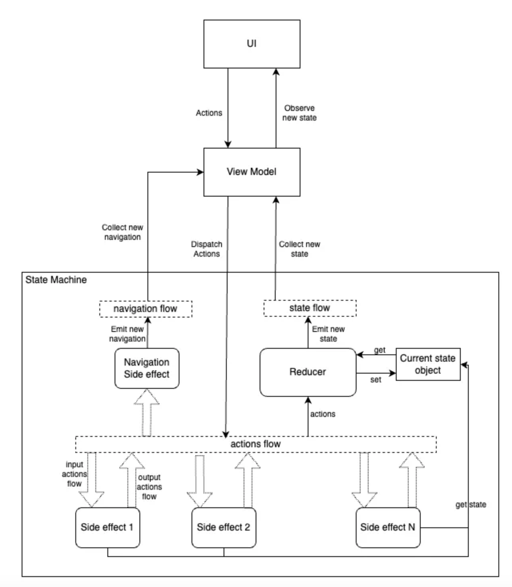

**Before talking about FlowRedux, these are some issues that exist in the Detail Module project when using the MVVM architecture.**

#### 1. State Management Issues

- Lack of immutability control, leading to potential bugs.
- No consistent approach to state creation, causing fragmentation.
- State not being a single source of truth.
#### 2. Flow and Debugging Challenges

- No unidirectional data flow, making debugging harder.
- Difficulties handling asynchronous operations in ViewModel.
- ViewModel Complexity & Maintainability

#### 3. UI logic in ViewModel causes excessive complexity over time.
- Code duplication and technical debt due to lack of structure.
- Difficult to maintain and extend, especially for new developers.
- Limitations in State Emission & Testing

#### 4. Hard to enforce ordered state emissions.
- Challenging to write unit tests for multiple state changes.

# I. Redux

### 1. What is Redux?

- Redux is a predictable state management pattern used in software development to manage and control the state (data) of an application. It provides a structured, centralized, and unidirectional data flow approach that promotes maintainability, predictability, and ease of debugging.

### 2. What are the benefits of implementing Redux in the project?

- Single Source of Truth: In Redux, the entire state of your application is stored in a single object. This single source of truth makes it easy to understand where to find the current state of the application as well as to maintain consistency across your application.
- State Immutability: Redux encourages immutable state. Instead of directly modifying the state, you create a new state object for each update. This makes it easier to track changes and maintain a history of state changes.
- Time-Travel Debugging: Redux supports time-travel debugging, which allows you to step forward and backward through the state changes in your application. This can be incredibly useful for tracking down bugs and understanding how your application reached a particular state.
- Testability: Redux applications are generally more testable because the state changes are isolated. You can easily write unit tests for logic in reducers and side effects.
- Separation of Concerns: Redux promotes a clear separation of concerns by keeping the state logic in reducers and side effects separate from the UI components. This makes your codebase more maintainable and scalable.
- Scaling and Performance: Redux is designed to handle complex state management efficiently. With proper usage, it can help you maintain good performance in your application even as it grows.

### 3. What are the key components of Redux?

- **State Machine**: This might not be a common definition in the world of web Redux, but in the context of Android applications, you can use it to replace the concept of a "state management container." A state machine can encompass key components of Redux, such as the Redux store, reducer, actions, and side effects. It serves as a place to connect these components together and functions as a machine to manage the state.

    ```java
    interface StateMachine<State : Any, Action : Any> {
    
        /**
         * A [Flow] that emits the current state as well as all changes to the state.
         */
        val state: Flow<State>
    
        /**
         * An [Action] to the [StateMachine]. The implementation can mutate the [State] based on
         * these actions or trigger side effects.
         */
        suspend fun dispatch(action: Action)
    }
    ```

  FlowReduxStateMachine is a StateMachine where connect Redux’s components

    ```java
    
    abstract class FlowReduxStateMachine<S : Any, A : Any, N : Any> : StateMachine<S, A> {}
    // Where S is generic type of State, A is generic type of Action, N is generic type of Navigation
    ```

- State:  **UI = f(state)**

  Refers to the data that represents the entire state of your application at a given point in time. This state data includes all the information and variables necessary to describe the current condition of your application. State should be immutable and not modified directly. Only the reducer is the place where new state should be created. State can be a data class or sealed class.

- **Actions**: Descriptions of events or user interactions that trigger state changes. Actions are typically plain objects containing a type and, optionally, additional data (payload) related to the action. Actions are usually represented as a sealed class.

    ```java
    sealed class ListResultsAction {
    
        // this is the initial action
        object OpenScreen : ListResultsAction()
        data object ScrollToBottom : ListResultsAction()
    		// more actions defined here
    }
    ```


- **Navigation**: When you need to navigate to a different screen or open a web page, you define the navigation for it. This is very useful in cases where you need to handle some logic before navigating to other screens.

    ```java
    sealed interface ListNavigation {
        data class OpenDetailListing(val id:String): ListNavigation()
    }
    ```


- **Reducer**: Pure functions that define how the application's state changes in response to actions. Reducers take the current state and an action as input and produce a new state as output.

    ```java
    /**
     * A simple type alias for a reducer function.
     * A Reducer takes a State and an Action as input and produces a state as output.
     *
     * If a reducer should not react on a Action, just return the old State.
     *
     * @param S The type of the state
     * @param A The type of the Actions
     */
    typealias Reducer<S, A> = (S, A) -> S
    ```


- **Side effects**: A side effect is a function that takes a stream of actions and the current state as input and produces an actions stream containing new actions as output. This function is responsible for handling logic related to the actions being dispatched.

```java
/**
 * It is a function which takes a stream of actions and returns a stream of actions. Actions in, actions out
 * (concept borrowed from redux-observable.js.or - so called epics).
 *
 * @param actions Input action. Every SideEffect should be responsible to handle a single Action
 * (i.e using filter or ofType operator)
 * @param state [GetState] to get the latest state of the state machine
 */
typealias SideEffect<S, A> = (actions: Flow<A>, getState: GetState<S>) -> Flow<A>

/**
 * The GetState is basically just a deferred way to get a state of a [reduxStore] at any given point in time.
 * So you have to call this method to get the latest state.
 */
typealias GetState<S> = () -> S
```

# II. FlowRedux

### 1. What is FlowRedux?

FlowRedux is a concept derived from Redux and is implemented using coroutine Flow for Android applications. Additionally, there's RxRedux, which is implemented using RxJava or RxKotlin for Android apps. The primary programming paradigms in FlowRedux include reactive programming and functional programming.

### 2. Where is the UI logic implemented in FlowRedux?

In the MVVM architecture, the UI logic is primarily implemented within the ViewModel. When transitioning to Redux, the UI logic from the ViewModel is moved to a State Machine, and it is restructured, divided into implementation in reducers and side effects. The ViewModel now serves as a bridge between the UI and the State Machine.

It's clear that in MVVM, you typically only need two files for the ViewModel and state. However, when transitioning to Redux, you'll need to create multiple files for various Redux components, including actions, reducers, and side effects. But these files are interconnected and adhere to the principles of Redux, so you can easily understand the meaning and logic behind these files.

### 3. How does FlowRedux work?



- The UI will send actions to the ViewModel, which will dispatch these actions into the actions flow of the State Machine. The State Machine will give priority to sending actions to the reducer first. If the reducer handles the action, it will implement the logic to create a new state and emit it into the state flow of the State Machine. Consequently, the ViewModel will collect the new state. Since the UI has observed the state from the ViewModel, it will receive the new state to update the UI.
- Next, this action will be emitted into the input actions flow of each side effect. If a side effect handles the logic for this action, it will process it (the side effect can access the current state) and emit an action into the output actions flow. The output actions flows from the side effects will be merged into the action flows of the State Machine, and the process continues in a loop.
- However, in cases where a side effect doesn't handle a particular action, it will output an empty flow. Or if a side effect handles the logic for the action but doesn't generate any new actions, it will still output an empty flow.
- Regarding the navigation side effect, it is a type of side effect that accepts an input actions flow but doesn't have an output actions flow. It handles the logic for navigation and emits new navigation into the navigation flow of the State Machine. The ViewModel collects the new navigation to continue with the navigation process.


### 5. How to write unit tests for FlowRedux?

Currently, because we have applied the CLEAN Architecture, the code in the domain and data layers is easily testable, and most of the business and data logic is well covered. However, UI logic in the presentation layer is not fully covered. Most of the UI logic is implemented within the ViewModel, but the code in the ViewModel is not testable, resulting in insufficient unit test coverage for the UI logic in features. This is an area where we need improvement. We need to make the code implementing UI logic in the presentation layer more testable.

When reviewing the operational diagram of FlowRedux, it's evident that UI logic from the ViewModel has been moved to the State Machine and subdivided into reducers and side effects. Therefore, to achieve comprehensive test coverage for the UI logic, you need to write unit tests for all side effects, unit tests for the logic that creates the state within the reducers, and unit tests for navigation.

### 6. The disadvantages of FlowRedux

With FlowRedux, you will indeed need to write more code, and because creating testable code, it also requires writing more unit tests. Therefore, it requires a basic understanding of Redux, as well as proficiency in reactive and functional programming. Having these skills is essential for maintaining good productivity when working with Redux. Without them, you may find it challenging to complete tasks efficiently, and productivity may be low.

In some cases, when the logic of a feature is simple, applying Redux may be overkill, so using MVVM or MVP is sufficient as long as you can write unit tests. Therefore, it requires experience to analyze whether Redux should be used for that feature or not.
